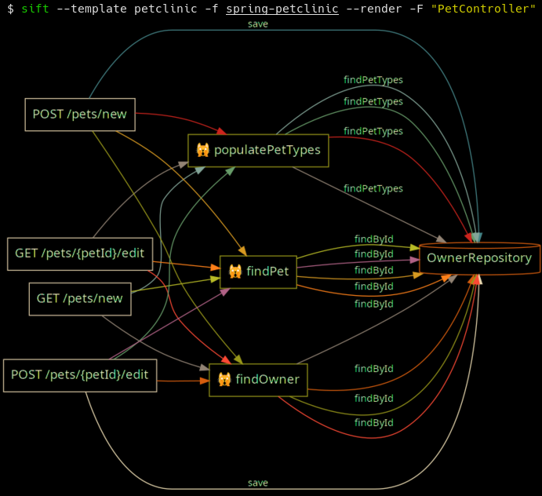
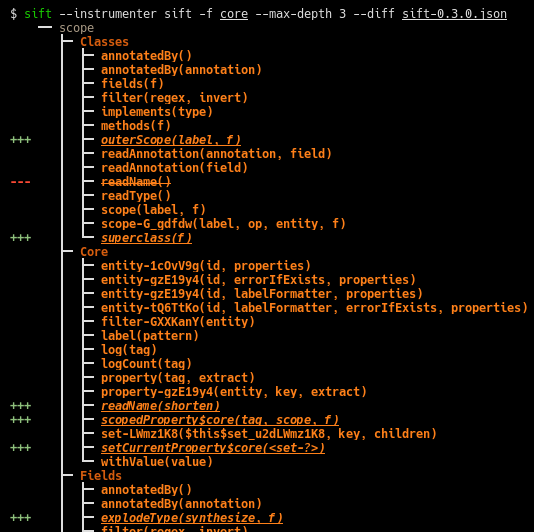
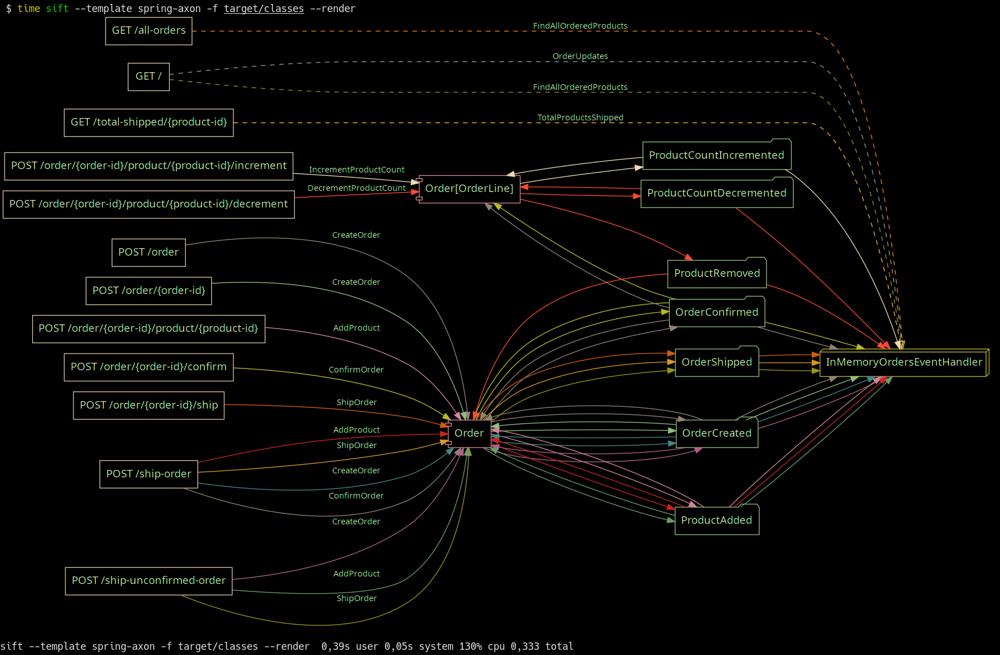

## Upcoming Release

### New/Tweaks
- `-f` option has been updated to also support URI paths and maven coordinates, for example: 
  `sift -f https:///path/to/classes.jar ...` and `sift -f net.onedaybead.sift:core:0.9.0 ...`.
- `--diff` now also works against class directories, jars, URI:s and maven coordinates. This
  means that it is no longer necessary to `--save` the system model before running `--diff`, e.g.:
  `sift --template sift -f net.onedaybead.sift:core:0.9.0 --diff net.onedaybead.sift:core:0.7.0`
- `--maven-repository` option has been added to specify additional Maven repositories for downloading artifacts.
  By default, Maven Central and local user repositories are always included.
- Remaining usages of `org.objectweb.asm.Type` replaced with `sift.core.dsl.Type`.
- DSL: The `fork` actions displayed when using the `--profile` flag now incorporate the
  labels from the `scope()` functions.  

### Breaking change
- - `siftrc.sh` and `siftrc.zsh` replaced by `sift.config`. Update custom configurations to this new file.


## sift-0.9.0 2023-04-22

### Entity Registration with Generic Types

Entities can now be registered against generic type signatures, such as `Repository<User>`. This first iteration
does not cover all use-cases, specifically type arguments inferred from context are currently not resolved,
leading to sift ignoring the generic signatures of method invocations.

### Breaking change: `sift.core.dsl.Type` supersedes `org.objectweb.asm.Type` 

The `sift.core.dsl.Type` class supersedes `org.objectweb.asm.Type` usage in the DSL. The new type
class supports incorporating generic type information and is generally easier to work with. Instances
of the new `Type` class are created with the `type()` function or the `String.type` extension property,
for example: `type("java.lang.String")` and `"java.lang.String".type`.

### Breaking change: entity property update strategies
Entity properties now overwrite existing properties by default, instead of appending to them . You can
can modify this behavior by specifying the `strategy` parameter in the `property()` function. For example:

```kotlin
property(PropertyStrategy.unique, foo, "labels", withValue("hello"))
```

Property strategies are one of: `replace`, `append`, `prepend`, `immutable` and `unique`. 

### New/Tweaks
- DSL/Class: added `inherited` parameter to `methods()` and `fields()` to include inherited methods and fields.
- Enhanced performance primarily focused on element trace optimizations - the process of interrelating
  elements as they are navigated by the DSL. This enhancement reduces the total execution time by up to
  40% for complex templates.
- DSL/Method: `filterName()` added string overload for `name`.
- DSL/Method: `fieldAccess {}` to iterate accessed fields.
- Entity elements of `Entity.Type.fieldAccess` can now be either fields or classes. If the latter, 
  then the type of the field is used.
- siftrc.zsh|sh is now created under `~/.local/share/sift/`. It currently holds `SIFT_ARGS`, CLI options
  always appended.
- `--stastistics` prints statistics about the state from the execution of the system model template.


### Breaking changes
- TODO: methods affected by `Type` change
  
### Fixes
- sift template: `object` Actions were not associated with their DSL methods.

## sift-0.8.0 2023-03-20

### Example template: Game Rental Sample Application

A short [template][example-gamerental] for the Game Rental demo application. It demonstrates
how to work with JPA entities, and wires axon entities against `@MessageMapping` endpoints.

 [example-gamerental]: template-examples/spring-axon-gamerental 

### New/Tweaks
- `--tree-root` option is now repeatable, allowing you to specify multiple roots.
  For example: `sift -t spring-axon -r command -r query ...`
- `--list-templates` option now displays a brief description for each template.
- `--dump-system-model` option now converts entity UUIDs to integers, making the output more readable.

### Fixes
- `DSL.property()`: would sometimes fail to update entity properties.
- `sift` template: fix DSL registration.
- IllegalArgumentException for methods declaring thrown exceptions as generic types, e.g.:
```java
public static <X extends Throwable> void propagate(Throwable t) throws X
```
- `spring-axon`: no longer fails if a `@Controller` doesn't register any REST endpoints.


## sift-0.7.0 2023-03-06

DSL documentation published to https://junkdog.github.io/sift/ 

### Example template: Spring PetClinic Sample Application

This is a short, [custom template][example-template] for the Spring Boot Pet Clinic demo
application. It demonstrates how to combine existing templates with custom templates,
describes relationships between entities, and configures properties for Graphviz visualization.



 [example-template]: template-examples/spring-petclinic-template

### New/Tweaks
- `--profile` now includes `ety#` column, tracking entity registrations.
- `--stacktrace` to print stacktrace on errors.
- DSL/Core: `editText(TextTransformer...)` for`property()`, currently used by `graphviz()`.
- DSL/Elements: inherits from `Core`, making it a bit more useful.

### Breaking changes
- DSL: changed package to `sift.core.dsl` from `sift.core.api`.
- DSL/Template: `graphviz(label=List<TextTransformer>)` replaces `removeSuffix` argument.   
- All scopes (Template, Classes, Methods...) are now top-level classes.
- DSL/Core: restricted value of `withValue(value)` to String, Number, Boolean, Enum. This 
  solves a lot of issues with serialization.

### Fixes
- DSL/property: Improved the `property()` method to resolve relationships via direct association 
  first. If direct association fails for all entities, it falls back on identifying relationships
  through shared common associations. The old behavior was to rely solely on shared common
  associations, but this could produce false positives. 
- Fix NPE when `--list-entity-types` is used with no path argument.
- `--list-entity-types` now resolves entity counts when system model is deserialized with `--load`.

## sift-0.6.0 2023-02-26

### New/Tweaks
- DSL.Template: `classesOf()`/`methodsOf()`/`fieldsOf()` now passes along the Entity.Type as a lambda parameter. 
- DSL.Template: `entity[key] = foo.(instantations|invocation|fieldAccess)`, replacing `registerInvocationsOf` and `registerInstantiationsOf`. 
- DSL.Class: `interfaces(recurisve, synthesize)` iterates interfaces of inspected class nodes. 
- DSL.Class: `filter(Modifiers..., invert)` iterates classes with matching modifiers. 
- DSL.Class: `enums {}` opens a field scope iterating all enum values (as static final fields). 
- DSL.Field: `filterType()` of fields. 
- DSL.Field: `filter(Modifiers..., invert)` iterates fields with matching modifiers. 
- DSL.Method: `filter(Modifiers..., invert)` iterates methods with matching modifiers. 
- DSL.Parameter: `filterType()` of parameters. 
- dot: Remove need for specifying `"dot-ignore"` property.
- DSL: re-registering the same entity using `entity(entitty, label...)` will now update the entity label.
- CLI: `--edge-layout=spline|polyline|ortho`, used together with `-R`/`--render`.
- `spring-axon`: member aggregate label changed to `$aggregate[$member]`.
- `spring-boot`: base template, extended by `spring-axon`.

### Breaking changes
- Instrumenter Service renamed to System Model Template:
  - pipeline() is now template()
  - `instrumenter {}` is now `template {}`
- `DSL.Instrumenter.graphviz()`: parameter `stripLabelSuffix` renamed to `removeSuffix`.
- Entity Types can can only be associated with a single element type (class, method, etc). 
- Internal visibility on many classes previously marked as public.

### Fixes
- `spring-axon`: fix member aggregate identification when field type is a Map. 
- `spring-axon`: improved identification of projections.
- Inadvertent exclusion of entities from the tree if the added entity also occurred as a parent.
- graphviz: childless entities could throw a NoSuchElementException.


## sift-0.5.0 2023-01-14

### Reverse registrations 

"Reverse registration" of invocations and instantiations of entities is now possible. This means that,
in addition to `foo["a"] = bar.instantations` and `foo["b"] = bar.invocations`, we can now also register
instances of `foo` that are invoked or instantiated by `bar`:  

```kotlin
methods {
    // note that `bar` represents the contextual method elements in the current scope
    foo.invocations["invoked-by"] = bar
    payload.instantations["created-by"] = bar
}
```

### Customizing entity labels with TextTransformers

The TextTransformer interface provides static functions for updating entity labels:

- `dedupe`: removes duplicate instances of a specified character.
- `replace`: replaces all occurrences of a specified string or regular expression with a given replacement string.
- `idSequence`: replaces matches of a given regular expression with sequentially assigned values, starting at 1.
- `uuidSequence`: replaces UUID:s with sequentially assigned values, starting at 1.

The `label` function has been updated to take TextTransformers as a vararg parameter, and applies them in order:

```kotlin
entity(E.endpoint,
    label("$method /\${base-path:}\${path:}",
        dedupe('/'),                 // drop repeating '/'
        replace(COMMON_PREFIX, "")), // shorten URL
    property("path", readAnnotation(httpMethod, "value"))
)
```

### Elements: Scope-erased scope

The `Elements` context is a type-erased scope that only provides methods defined by the `Core` scope class.
This new scope adds a layer of abstraction to the DSL, making it easier to reuse code and update properties
in a more flexible way.

### New
- DSL.Parameter: generic `signature {}` scope.
- DSL.Method: Reverse association with `foo.instantiations["created-by] = bar` and `foo.invocations["called-by] = bar` 
- DSL.Signature: `explodeTypeT(signature) {}` extracts type `T` from signature pattern, e.g. `Map<String, List<T>>`. `_` matches any type. 
- DSL.Instrumenter: `elementsOf(e) {}` iterate over all entities without element-specific methods. Useful for property tagging. 
- DSL.Instrumenter: `graphviz(e, ...)` which allows setting graphviz properties such as identifier, rank, type, shape, style, etc.
- DSL: `filter(string)` is a short-hand for `filter(Regex.fromLiteral(string))`
- `spring-crud` instrumenter - very similar to `jpa`.

### Breaking
- Multiple classes changed packages and visibility; ongoing.
- `Gruxbox` and `Style` moved to `sift.core.terminal` from `sift.instrumenter`.
- SPI: `InstrumenterServiceProvider` is now optional when implementing `InstrumenterService` since json
  serialization is typically more convenient. 
- Due to some internal renaming, any custom pipelines need to be recompiled/resaved to work with the new version.
- `Style.plain()` no longer accepts optional `dedupe` argument as that functionality is now taken care of by TextTransformers.

### Fixes
- Entities were sometimes not relatable when calling `property()` from a scope not directly related to the scope
  which registered the entity. 

  
## sift-0.4.0 2022-12-07

### New
**Signature Scope**: Limited DSL support for exploring generics/type signatures, e.g. `Foo` inside `List<Foo>`.
Note that entities cannot be registered inside the signature scope. The type argument has to be registered by
its raw class, using `explodeType() {}`.

Support for method parameter signatures is currently lacking from the DSL.

**`sift` Self Instrumenter**: A new instrumenter has been added that extracts the system model centered around
the DSL. This instrumenter allows you to compare the changes to the DSL between releases using the `--diff` option.
Currently, Sift does not have support for resolving Kotlin constructs, so some of the DSL method names may
be mangled.



- DSL.Class: `outerScope {}` inner classes iterate over their outer classes.
- DSL.Class: `superclassSignature(synthesize=false) {}` - parent class signature `Foo<Bar>`; skips non-generic parents (WIP).
- DSL.Field: `explodeType(synthesize=false) {}` iterates class elements of fields.
- DSL.Field: `signature(synthesize=false) {}` - generic field signature; skips non-generic fields.
- DSL.Method: `filterName()` only inspects the method name; `filter()` also checks the class name.
- DSL.Method, DSL.Field, DSL.Parameter: entity property method `readName()`.
- DSL.Method: `returns(synthesize=false) {}` signature scope for method return 
- DSL.Signature: `explodeType(synthesize=false) {}` - class scope of current type arguments.  
- DSL.Signature: `filter(Regex)` - filters concrete type argument by class name.
- DSL.Signature: `scope {}` - local scope, as found elsewhere.
- DSL.Signature: `typeArgument(index) {}` - filters nested type argument by position.
- DSL.Signature: `typeArguments {}` - iterate nested type arguments.
- DSL: `readName(shorten=true)` shortens names of inner classes.
- Dot entity property `dot-shape` accepts valid graphviz shapes
- Entity labels: extract all
- property values by prefixing the property name with  `+`. E.g. `${+property}`.

### Fixes
- DOT: illegal node ids containing `.` and `$`.  

### Changes
- graphviz property `dot-id` renamed to`dot-id-as`. 
- updated spring-axon grahpviz to use `dot-shape`.


## sift-0.3.0 2022-11-18

### Breaking
- DSL: `update` used for updating properties on existing entities is renamed to `property`. 
- DSL: `parentScope` renamed to `outerScope` in the name of clarity.  

### Fixes
- introspection of kotlin's noinline lambdas  

### New
- CLI: `--render`/`-R` prints entities in graphviz's DOT language. `sift.zsh` and `sift.sh` automatically
  pipe to graphviz and displays the diagram inline. Note that `-R` will print the DOT script to stdout.

- CLI: `--dump-system-model` prints all entities and their properties. Primarily useful for debugging.  
- `sift.sh`, QoL script similar to `sift.zsh`

### Changes
- `mvn install` installs the executable into `~/.local/share/sift/bin`. If compiling with `-P native-image`,
  the native sift executable is also copied. 
- "backtrack" references are now added to all child entities. 


## sift-0.2.0 2022-11-11
### Breaking
- CLI: `-f` replaces PATHS argument; filter changed to `-F`

### Features
- CLI: `--version` option
- CLI: `--save`/`-s` save the resulting system model as json
- CLI: `--diff` compares a previous model with the current state 
- CLI: `--load` restores a previously saved model instead of instrumenting classes 


## sift-0.1.0 2022-11-06
- initial release
