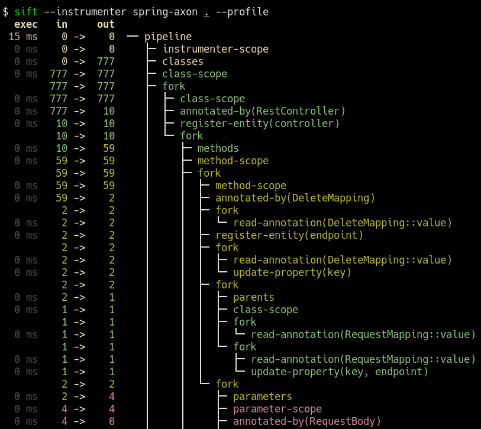

# sift

A tool to model and analyze the design of systems from java class files.

## Features 
- CLI tool for building, querying and [diff-ing][diff] "system models" from parsed .class files.  
- System models consist of Entities and are produced by Instrumenter Pipelines.
- Instrumenter Pipelines provide knowledge about technology stacks for bytecode analysis. 
- Declarative DSL for additional, user-defined pipelines.
- JSON serialization of pipelines for simpler reuse and sharing.


_Spring-Boot with Axon Framework [instrumenter][spring-axon] in action._ 

 [spring-axon]: instrumenters/spring-boot-axon-cqrs/src/main/kotlin/sift/instrumenter/sbacqrs/SpringBootAxonCqrsInstrumenter.kt#L150:L220
 [diff]: docs/images/sift-spring-axon-diff.png
## CLI options

```
Usage: sift [OPTIONS] [PATHS]...

  A tool to model and analyze the design of systems from bytecode.

  The PATHS argument can occur anywhere, and multiple times, in the argument list. Any argument which
  isn't matched as an option is treated as an element of PATHS.

Options:
  -i, --instrumenter INSTRUMENTER             the instrumenter pipeline performing the scan
  -t, --list-entity-types                     lists entity types defined by instrumenter.
  -L, --max-depth INT                         Max display depth of the tree
  -f, --filter REGEX                          filters nodes by label. can occur multiple times.
  -F, --filter-context REGEX                  filters nodes by label, while also including sibling nodes.
                                              can occur multiple times.
  -e, --exclude REGEX                         excludes nodes when label matches REGEX. can occur multiple
                                              times.
  -E, --exclude-type ENTITY-TYPE              excludes entity types from tree. can occur multiple times.
  -l, --list-instrumenters                    print all instrumenters detected on the current classpath
  --debug                                     prints log/logCount statements from the executed pipeline
  --version                                   prints version and release date
  --profile                                   prints execution times and input/output for the executed
                                              pipeline
  -T, --tree-root ENTITY-TYPE                 tree built around requested entity type
  -a, --ansi [none|ansi16|ansi256|truecolor]  override automatically detected ANSI support
  --generate-completion [bash|zsh|fish]
  -h, --help                                  Show this message and exit

Arguments:
  PATHS  jar or directory with classes
```

## Entity and Entity Type

The system model is described by its constituent entities and their relationships.
Each entity is uniquely identified by either a class, method, field or parameter element;
an element can not be associated with more than one entity.

All entities are mapped to a type. A type represents any notable part of the system,
e.g. REST controllers, HTTP endpoints, inbound/outbound messages, RDS etc. 

```bash
$ sift --instrumenter spring-axon --list-entity-types target/classes
entity types of spring-axon
  1 aggregate
  2 aggregate-ctor
  1 aggregate-member
  6 command
  6 command-handler
  1 controller
 13 endpoint
  7 event
  7 event-handler
  7 event-sourcing-handler
  1 projection
  3 query
  4 query-handler
```
## Instrumenter pipelines

Instrumenter Pipelines provide knowledge about a technology stack and/or
project-specific constructs. The pipeline produces the system model from 
the input classes. 

Pipelines are written in a declarative DSL, which provides high-level
abstractions for identifying and interrelating entities from class structure or usage.

```kotlin
val controller = Entity.Type("controller")
val endpoint = Entity.Type("endpoint")

instrumenter {
    // iterate over all input classes
    classes {                                                      
        annotatedBy<RestController>() // filter classes 
        entity(controller)            // mark remaining as 'controller'  
        methods {                     // iterate all controller methods
            annotatedBy<Endpoint>()   // filter @Endpoint methods
            entity(endpoint)

            // associate controllers with their endpoints  
            controller["endpoints"] = endpoint
        }
    }
}
```
Input elements - classes, methods, parameters and fields - are processed in batch, line-by-line.

A Instrumenter Pipeline can be expressed in about 100LOC. Some are notably shorter, e.g. [jpa][jpa]
and [jdbi][jdbi]. User-defined pipelines may choose to `include()` multiple existing pipelines,
e.g. `spring-axon` and `jpa`, to better describe the underlying system while also keeping the
resulting pipeline DSL concise.

 [jpa]: instrumenters/jpa/src/main/kotlin/sift/instrumenter/jpa/JpaInstrumenter.kt#L48:L73
 [jdbi]: instrumenters/jdbi/src/main/kotlin/sift/instrumenter/jdbi/Jdbi3Instrumenter.kt#L54:L67

The execution of an Instrumenter Pipeline can be visualized with `--profile`:




## Caveats and limitations
- no flow control
