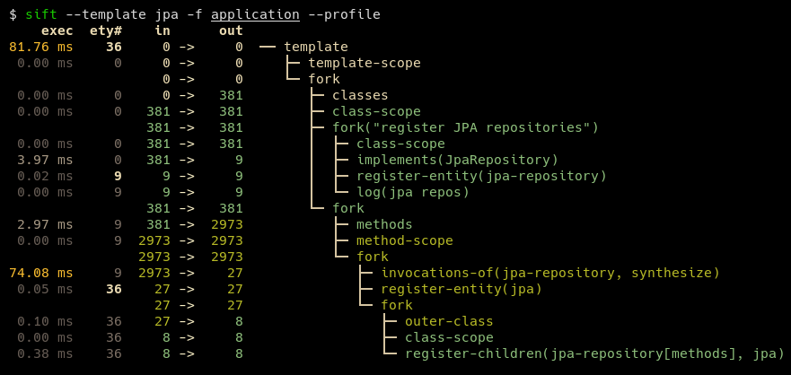

# sift

[](https://maven-badges.herokuapp.com/maven-central/net.onedaybeard.sift/sift/badge.png)
[](https://junkdog.github.io/sift/)

Sift is a command-line tool that analyzes and reverse models software system designs from JVM bytecode.
It operates by processing .class or .jar files using predefined templates known as System Model
Templates. These templates provide knowledge about technology stacks or project-specific constructs,
which enables the tool to generate a comprehensive model of the system.

The resulting system model is composed of entities that describe the system's structure and behavior.


## Features
- CLI tool for building, querying, and [comparing][diff] system models from parsed .class files.
- Declarative DSL for writing user-defined templates, optionally extending or combining existing templates.
- JSON serialization of templates for easy reuse and sharing.
- Render system representations using Graphviz. Inline rendering for [kitty][kitty] supported via sift.sh|zsh.
- Optionally built as a native binary using GraalVM's native-image, allowing for much faster execution times.
  This means that Sift can typically analyze most microservice-sized projects in under 0.5 seconds.

![sift spring-boot axon framework][orders-graph]


_Spring-Boot with Axon Framework [template][spring-axon] in action; filtering on shipped and confirmed orders
in https://github.com/eugenp/tutorials/tree/master/axon._

[![][orders-t]][orders] [![][system-render-t]][system-render] [![][dump-sm-t]][dump-sm] [![][sift-dsl-t]][sift-dsl]

 [kitty]: https://sw.kovidgoyal.net/kitty/

 [spring-axon]: templates/spring-boot-axon-cqrs/src/main/kotlin/sift/template/sbacqrs/SpringBootAxonCqrsTemplate.kt#L127:L246
 [diff]: docs/images/sift-spring-axon-diff.png
 [graphviz]: docs/images/sift-spring-axon-render.png
 [sift-render]: docs/images/sift-render-s.png

 [orders]: https://raw.githubusercontent.com/junkdog/sift/main/docs/images/sift-spring-axon-orders.png
 [orders-t]: docs/images/sift-spring-axon-orders_thumbnail.png

 [orders-graph]: docs/images/sift-spring-axon-orders-render.png
 [orders-graph-t]: docs/images/sift-spring-axon-orders-render_thumbnail.png

 [system-render]: https://raw.githubusercontent.com/junkdog/sift/main/docs/images/sift-spring-axon-render.png
 [system-render-t]: docs/images/sift-spring-axon-render_thumbnail.png

 [dump-sm]: https://raw.githubusercontent.com/junkdog/sift/main/docs/images/sift-spring-axon-dump-system-model.png
 [dump-sm-t]: docs/images/sift-spring-axon-dump-system-model_thumbnail.png

 [sift-dsl]: https://raw.githubusercontent.com/junkdog/sift/dev/docs/images/sift-diff-maven-coords.png
 [sift-dsl-t]: docs/images/sift-diff-maven-coords_thumbnail.png

## CLI options

```
Usage: sift [OPTIONS]

  Sift is a command-line tool that analyzes and reverse models software system designs
  from JVM bytecode.

Template options:
  -t, --template TEMPLATE               The template producing the system model.
  -l, --list-templates                  Print all installed templates.
  -T, --list-entity-types               Lists entity types defined by template.
  -f, --class-dir, --classes PATH|URI|MAVEN_COORD
                                        Provide class input as a directory, JAR file, URI
                                        (pointing to a JAR), or Maven coordinate.
  -d, --diff FILE_JSON|URI|MAVEN_COORD  Compare the system model from '-f' with another,
                                        specified as a JSON file (previously saved System
                                        Model), class input as a directory, JAR file, URI
                                        (pointing to a JAR), or Maven coordinate.
  --profile                             Print execution times and input/output for the
                                        executed template.
  -X, --dump-system-model               Print all entities along with their properties and
                                        metadata.

Entity tree/graph options:
  -L, --max-depth INT             Max display depth of the tree.
  -F, --filter REGEX              Filter nodes by label. (repeatable)
  -S, --filter-context REGEX      Filter nodes by label, while also including sibling
                                  nodes. (repeatable)
  -e, --exclude REGEX             Exclude nodes when label matches REGEX. (repeatable)
  -E, --exclude-type ENTITY_TYPE  Exclude entity types from tree. (repeatable)
  -r, --tree-root ENTITY_TYPE     Tree built around requested entity type. (repeatable)
  --no-emoji                      Disables printing emoji in entity labels.

Visualization options:
  -R, --render                          Render entities with graphviz's DOT language.
  --edge-layout [spline|polyline|ortho]
                                        Sets the layout for the lines between nodes.
                                        (default: spline)

Serialization options:
  -s, --save FILE_JSON  Save the resulting system model as json.
  --load FILE_JSON      Load a previously saved system model.

Miscellaneous options:
  -a, --ansi [none|ansi16|ansi256|truecolor]
                                        Override automatically detected ANSI support.
  --stacktrace                          Print stacktrace to stderr if an error occurs
  --version                             Print version and release date.
  --debug                               Print log/logCount statements from the executed
                                        template.
  -m, --maven-repository VALUE          Additional maven repositories to use for
                                        downloading artifacts. Maven central
                                        (https://repo1.maven.org/maven2/) and local user
                                        repositories are always included.
  --statistics                          Print internal statistics about the system model
                                        template context.
  --generate-completion [bash|zsh|fish]
  -h, --help                            Show this message and exit

Examples:
  sift --template spring-axon -f my-spring-project
  Model the system using the "spring-axon" template on the classes in the
  "my-spring-project" directory.

  sift -t spring-axon -f . -F "Order(Created|Shipped)" --save feature-01.json
  Model the system using the "spring-axon" template on the current directory's
  classes, filter nodes containing the regular expression "Order(Created|Shipped)",
  and save the system model to "feature-01.json".

  sift -t spring-axon -f . --diff feature-01.json
  Compare the current design of the system using the "spring-axon" template on
  the classes in the current directory against a previously saved system model
  from "feature-01.json" and show the differences.

  sift -t spring-axon -f . -F "Product" --render
  Model the system using the "spring-axon" template on the current directory's
  classes, filter the graph to show only nodes containing "Product", and render
  the result using graphviz's DOT language.

```

## System Model Templates and Entities

The system model describes the structure and relationships of entities within a system.
An entity is an object or component within the system, uniquely identified by a class,
method, field, parameter or generic signature. 

Entities are categorized by their `Entity.Type`. An entity type represents any
noteworthy part of the system. For example, types can include REST controllers, HTTP
endpoints, inbound/outbound messages, RDS, repositories and more.

```bash
$ sift --template spring-axon -f target/classes --list-entity-types 
entity types of spring-axon
  1 aggregate
  2 aggregate-ctor
  1 aggregate-member
  6 command
  6 command-handler
  1 controller
 13 endpoint
  7 event
  7 event-handler
  7 event-sourcing-handler
  1 projection
  3 query
  4 query-handler
 ```
System Model Templates describe how entities are identified within a given technology stack
and/or project-specific constructs. The templates are written in a declarative DSL and are
used to produce the system model from input classes. The DSL provides high-level abstractions
for identifying and interrelating entities from class structure or usage.

The code below shows a simple System Model Template that identifies REST controllers and
HTTP endpoints within a system and associates the two entities.

```kotlin
val controller = Entity.Type("controller")
val endpoint = Entity.Type("endpoint")

template {
    // iterate over all input classes
    classes {                                                      
        annotatedBy<RestController>() // filter classes 
        entity(controller)            // mark remaining as 'controller'  
        methods {                     // iterate all controller methods
            annotatedBy<Endpoint>()   // filter @Endpoint methods
            entity(endpoint)

            // associate controllers with their endpoints  
            controller["endpoints"] = endpoint
        }
    }
}
```
Input elements (classes, methods, parameters, fields, generic signatures) are processed in batches,
line-by-line. The execution of a System Model Template can be introspected with the `--profile` option.



A typical template can be expressed in about 100-200 lines of code. Some templates,
such as those for [JPA][jpa] and [JDBI][jdbi], are notably shorter. User-defined templates
can include multiple existing templates to better describe the underlying system while also
keeping the resulting DSL concise.

 [jpa]: templates/jpa/src/main/kotlin/sift/template/jpa/JpaTemplate.kt#L40:L64
 [jdbi]: templates/jdbi/src/main/kotlin/sift/template/jdbi/Jdbi3Template.kt#L46:L61


## Installation

Sift requires a java 17 or later runtime.

For window users, it is recommended to to run sift under WSL, until proper windows
paths are in place.

The easiest way to install sift is to clone the repository and run `mvn install`, and
then copy sift.zsh|sh to a location on the `$PATH`, e.g.:

- `mvn install` from project root. This installs sift to `~/.local/share/sift/bin`
- copy either `sift.zsh` or `sift.sh` to `~/.local/bin/sift`

The `main` branch always points to the latest release commit.


### Building a native binary on linux using GraalVM

If GraalVM and native-image is installed, a native binary can be built with the `native-image`
maven profile: `mvn install -P native-image`. The resulting binary will be located in
`~/.local/share/sift/bin/sift`. `sift.zsh` and `sift.sh` first checks if the native binary
is available, otherwise it tries to run the jar.

The native binary is considerably faster than the jar, but it can cause issues if it needs
to deserialize a system model (via `--load` or `--diff`) or system model template containing
unknown types (e.g. from `withValue()`).


## Caveats and limitations
- no flow analysis making precise entity identification difficult for e.g. dispatcher-like 
  methods dealing with multiple entity types.
