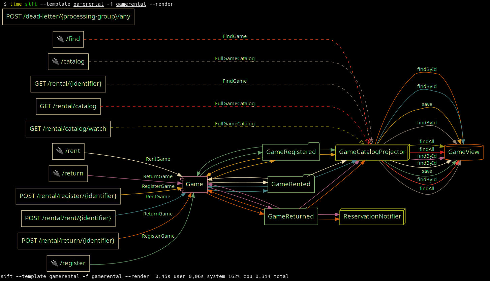

A basic template for the [Gane Rental Sample Application][gamerental].

 [gamerental]: https://github.com/smcvb/gamerental

#### This template:
- uses `includes(template)` to extend the `spring-axon` and `jpa` templates.
- defines a new entity type, `E.modelAttributes`, for `@ModelAttribute` endpoint methods.
- wires JPA entities and `@MessageMapping` endpoints with existing entities, primarily from identifying instantiations.
- graphviz property configuration for `--render`.


 

## install template

Install the template by running `main()` in Install.kt


## Clone GameRental demo project

Clone and build the GameRental project.

```
git clone git@github.com:smcvb/gamerental.git
mvn -f gamerental compile
```

